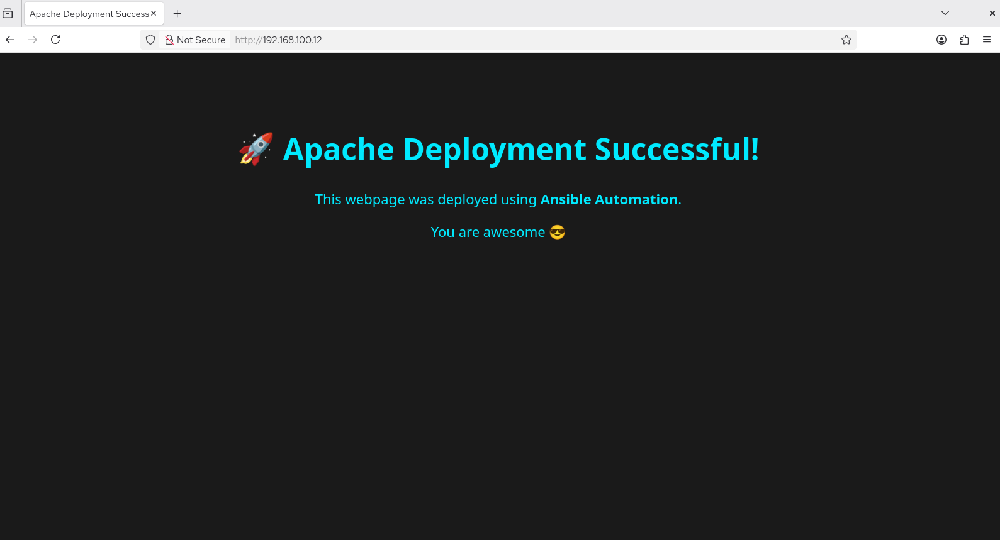

# 🚀 Ansible Apache Automation Project

## 📌 Project Overview

This project demonstrates **automated installation, configuration, and deployment of an Apache HTTPD web server** on multiple Linux servers using **Ansible**.

With a single playbook execution, Apache is installed, enabled, started, and a custom `index.html` file is deployed across all target nodes.

This project reflects **real-world DevOps / SysAdmin automation practices** such as configuration management, idempotency, and infrastructure consistency.

---

## 🛠️ Technologies Used

* **Ansible** (Automation & Configuration Management)
* **Apache HTTPD** (Web Server)
* **Linux** (Target Servers)
* **SSH Key-based Authentication**

---

## 📂 Project Structure

```
Ansible-Apache-Automation/
├── inventory
├── playbooks/
│   └── apache_deploy.yml
├── files/
│   └── index.html
└── README.md
```

---

## 🧾 Inventory File

Defines target hosts and SSH access:

```
192.168.100.12 ansible_user=root ansible_ssh_private_key_file=~/.ssh/ssh_accesskey
192.168.100.13 ansible_user=root ansible_ssh_private_key_file=~/.ssh/ssh_accesskey
```

---

## 📜 Ansible Playbook

**`apache_deploy.yml`** performs the following tasks:

1. Installs Apache (`httpd`)
2. Enables and starts the Apache service
3. Deploys a custom `index.html` webpage

### Key Features

* Uses **Ansible package module** (OS-agnostic)
* Uses **service module** for service management
* Uses **copy module** with proper ownership and permissions
* Fully **idempotent** (safe to run multiple times)

---

## 🌐 Deployed Web Page

The deployed web page confirms successful automation:

> 🚀 Apache Deployment Successful!
> This webpage was deployed using Ansible Automation.

---

## 📸 Project Output Screenshot

You can add a screenshot of the browser output here.

### How to Add Screenshot

1. Take a screenshot of the webpage output (`http://<server-ip>`)
2. Create a folder named `screenshots/`
3. Place the image inside it (example: `output.png`)
4. Add it below:

```

```

---

## ▶️ How to Run This Project

```bash
ansible-playbook -i inventory playbooks/apache_deploy.yml
```

Ensure:

* Ansible is installed on the control node
* SSH key-based authentication is configured
* Target nodes are reachable

---

## ✅ Use Cases

* Apache web server automation
* Configuration management practice
* DevOps & SysAdmin portfolio project
* Ansible fundamentals demonstration

---

## 🧠 Skills Demonstrated

* Infrastructure Automation
* Linux System Administration
* Ansible Playbooks & Modules
* Service Management
* Secure Remote Access (SSH)

---

## 👨‍💻 Author

**Shivam Ubale**
Aspiring DevOps / SysAdmin Engineer

---
